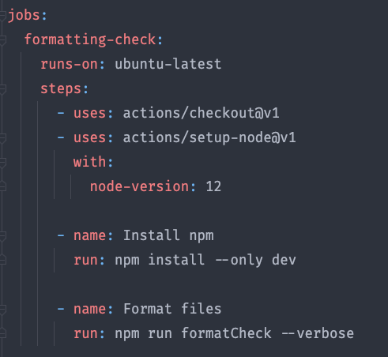
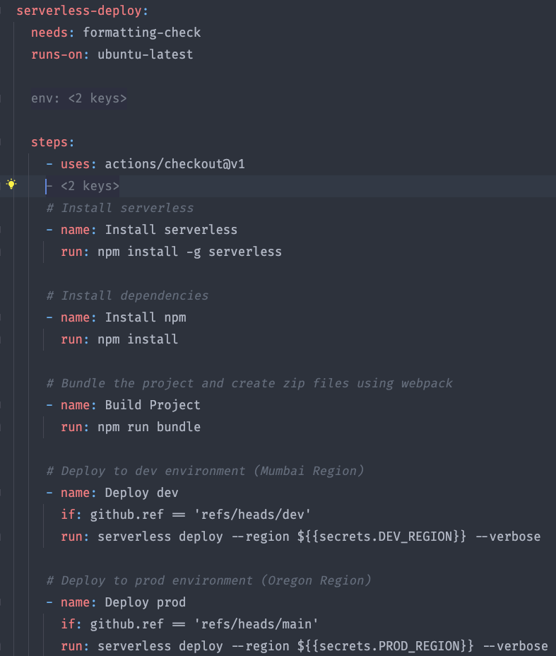

## AWS AppSync CRUD API for Blogs
This project is a template for AWS AppSync CRUD operations.

**Video explaining the project structure and IaC with API testing:**
<div align="left">
  <a href="https://www.youtube.com/watch?v=THFPUMcF86E"></a>
</div>

### Services
- AWS AppSync
- AWS Lambda
- Amazon DynamoDB
- Serverless Framework for IaC.
- GitHub actions for CI/CD.
- Webpack for packaging code.
- ESLint for linting.

### How to setup the project

#### `npm install`
- This will install all the required dependencies.

#### `npm run format`
- format all the files using ESLint

#### `npm run bundle`
- Packages the code using WebPack

#### `sls deploy`
- This command will deploy the resources to AWS using dev credentials

### Folder Structure
```markdown
.
├── .gitHub            # CI/CD workflow for GitHub actions
├── Lambdas            # NodeJs code for all 4 CRUD Lambdas, including dynamodb helper functions
├── mapping-templates  # Mapping templates for getBlog query and create, update, delete mutations 
├── Resources          # AppSync mapping templates configuration and roles
├── schema.api.graphql # AppSync schema
├── serverless.yml     # Serverless framework configuration file supporting IaC
├── serverless-appsync-api.yml  # AppSync plugin configuration for data sources
├── LICENSE
└── README.md
```

### CI/CD Setup (GitHub Actions Workflow)
#### Steps to setup CI/CD using GitHub Actions
The following is the list of steps that is executed as a part of the CI/CD setup:

1. Store all account credentials in GitHub secrets to access them in environment without exposing. The AWS credentials will be used for deploying the application into your AWS account.
```
AWS_ACCESS_KEY_ID: ${{secrets.AWS_ACCESS_KEY_ID}}
AWS_SECRET_ACCESS_KEY: ${{secrets.AWS_SECRET_ACCESS_KEY}}
DEV_REGION: ${{secrets.DEV_REGION}}
PROD_REGION: ${{secrets.PROD_REGION}}
```
2. Install serverless
3. Install npm
6. Build project using webpack
7. Deploy to dev environment: Mumbai (ap-south-1)
8. Deploy to prod environment: Oregon (us-west-2)

#### Image for the Format Checker job:
</p>

#### Image for the Serverless deploy job:
</p>